# ESP32-3248S035在Arduino IDE上的编译和上载
本教程目的是展示如何通过Arduino IDE对ESP32进行编程和上载。
Arduino IDE有个附加组件的功能，通过这个功能可以安装ESP32组件，且Arduino IDE可以在Windows, Mac OS X or Linux等多个系统上运行。


## 先决条件
- 电脑上已经装有Arduino IDE
如果还未安装，请在Arduino官网链接进行Arduino IDE下载安装：[https://www.arduino.cc/en/software](https://www.arduino.cc/en/software)
**注：本教程使用的是旧版本 1.8.19，并不推荐使用2.0及以上版本，这两个版本差异较大，可能会出现执行异常的情况。**

有关 **ESP32-3248S035** 的资料包，请前往下载
[FZ5821A-3.5inch_ESP32-3248S035.zip](https://pan.baidu.com/s/1l0-mM-d07XuXz0gYd6AgHA?pwd=vcjd)

## 在Arduino IDE上安装ESP32板组件
要在Arduino IDE中安装ESP32板组件，请按照如下步骤进行操作
1. 在Arduino IDE中，转到 **File** >  **Preferences**
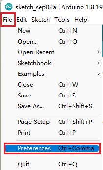

2. 在“Additional Board Manager URL”字段中输入以下内容，如下图，然后点击OK
>  https://raw.githubusercontent.com/espressif/arduino-esp32/gh-pages/package_esp32_index.json
      
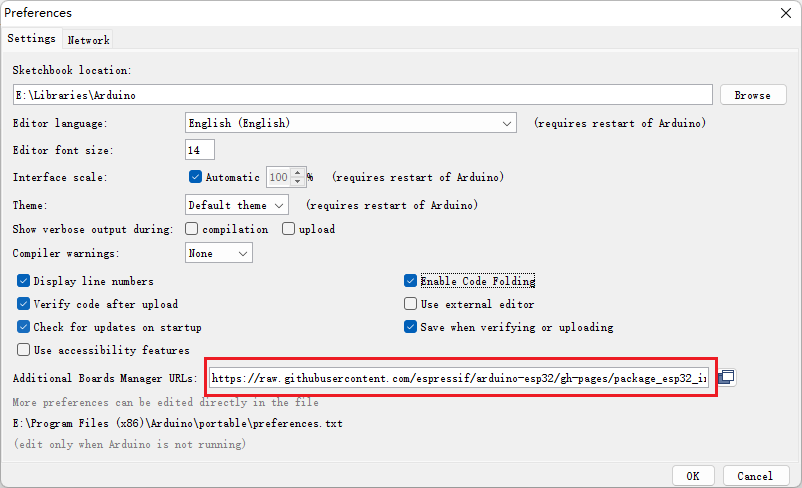

注意：如果您已经有其他的开发板的URL，您可以用逗号分隔URL，如下所示：
>  https://XXX.json,
>  https://raw.githubusercontent.com/espressif/arduino-esp32/gh-pages/package_esp32_index.json

3. 打开**Board Manager**。转到 **Tools** >  **Board** > **Boards Manager**
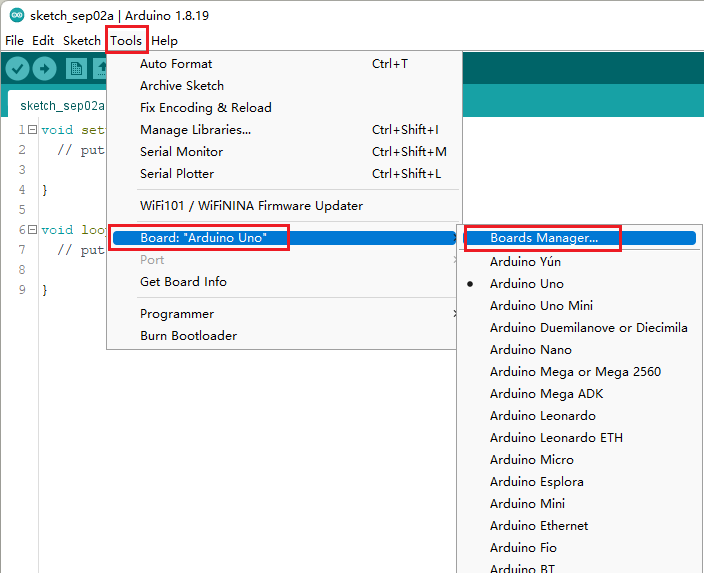
4. 搜索 **ESP32** 并按 **ESP32 by Espressif Systems** 的 **Install** 按钮，等待安装完成
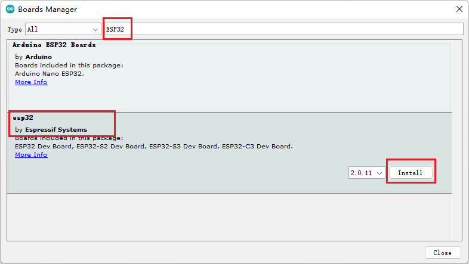
注意：安装大概需要几分钟时间，请耐心等待一会儿，如果安装失败可以多尝试几次
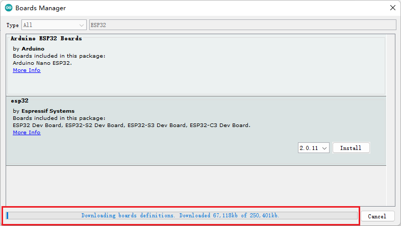
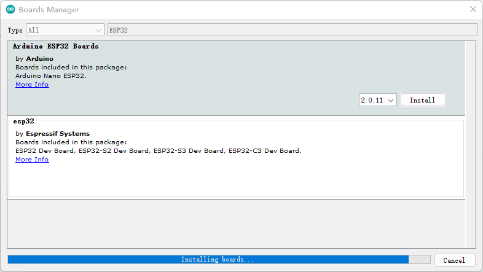
安装成功
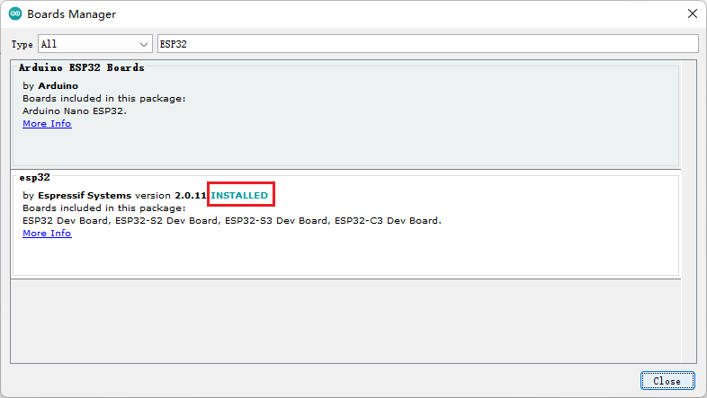

## 在Arduino IDE上选择正确的开发板及烧录方式
请确认ESP32板组件已经成功安装后执行以下步骤

1. 在Arduino IDE中，转到 **Tools** >  **Board:'XXX'** >  **ESP32 Arduino'** > **ESP32 Dev Module'** 
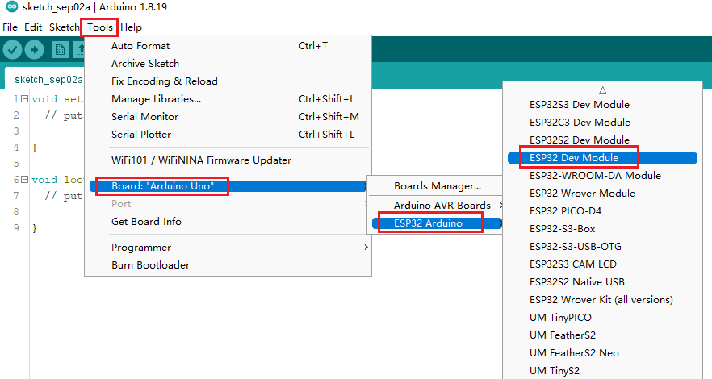

2. 在 **Tools** 选项卡按照下图选择对应的选项及烧录工具
 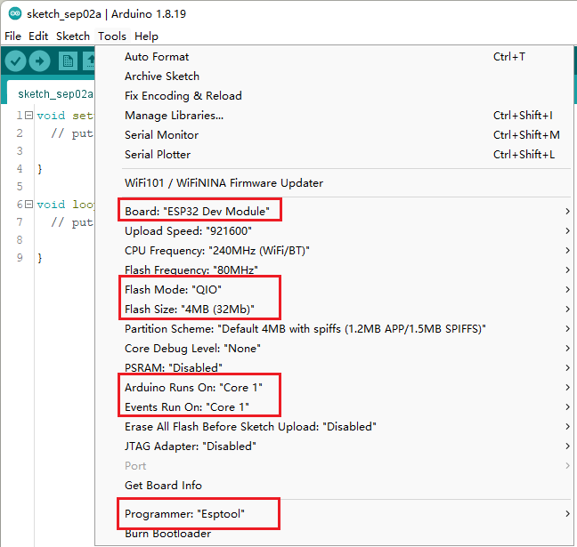
注意的是，上传代码后，设备将开始运行它。因此，如果我们想上传新程序，我们需要重置设备的电源，以确保它进入闪烁状态

## 现在我们来尝试写一个经典的小程序 Hello World 来进行测试
先确认 **ESP32-3248S035** 已经接到电脑上，并且驱动已经正常工作，如下图
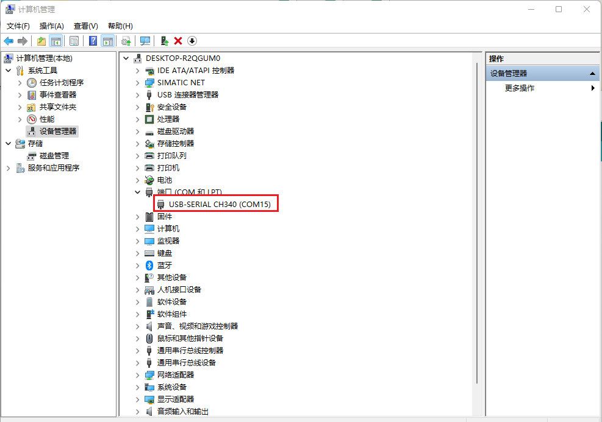

注：如果以上驱动没有自动安装，请在资料包的
 **3.5inch_ESP32-3248S035\7-Character&Picture_Molding_Tool** 路径下安装 **USB-SERIAL CH340.rar** 驱动

1. 在Arduino IDE的编码区写入测试的代码，代码如下：
```c
void setup()
{
  Serial.begin(115200);
}
void loop()
{
  Serial.println("HelloWorld");
  delay(2000);
}
```
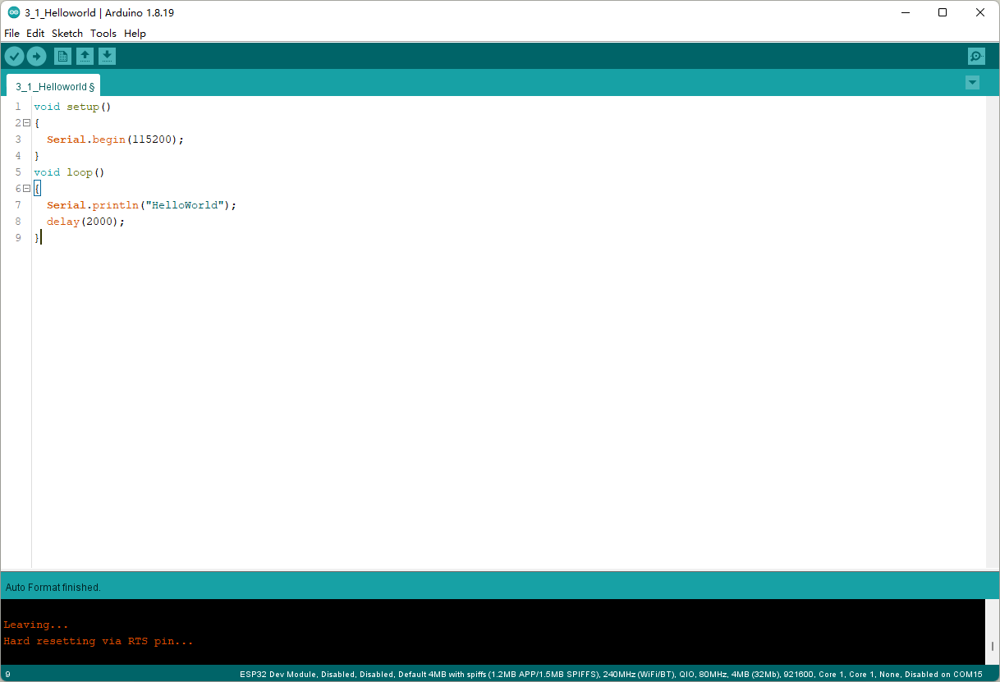
2. 选择对应的COM口并进行烧录上传
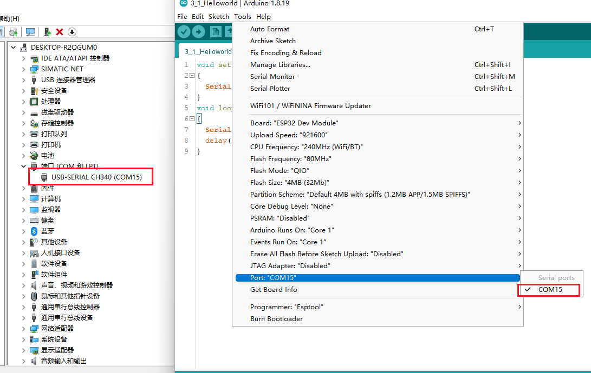
3. 点击编译并上传，显示烧录成功（此处可无需进行断电或者重启操作）
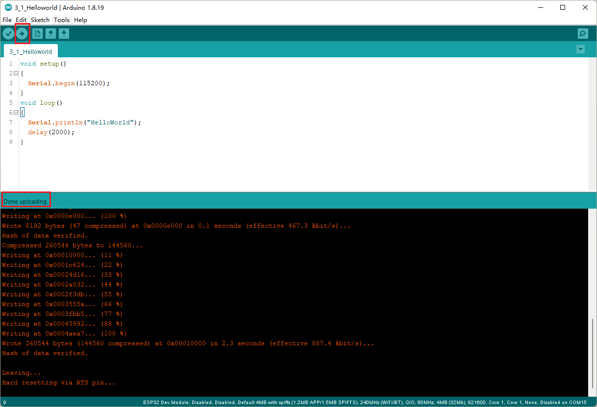
4. 通过Arduino IDE的串口监视器进行查看程序是否正常工作
可选择 **Tools** >  **Serial Monitor'** >  或者右边串口监视器图标
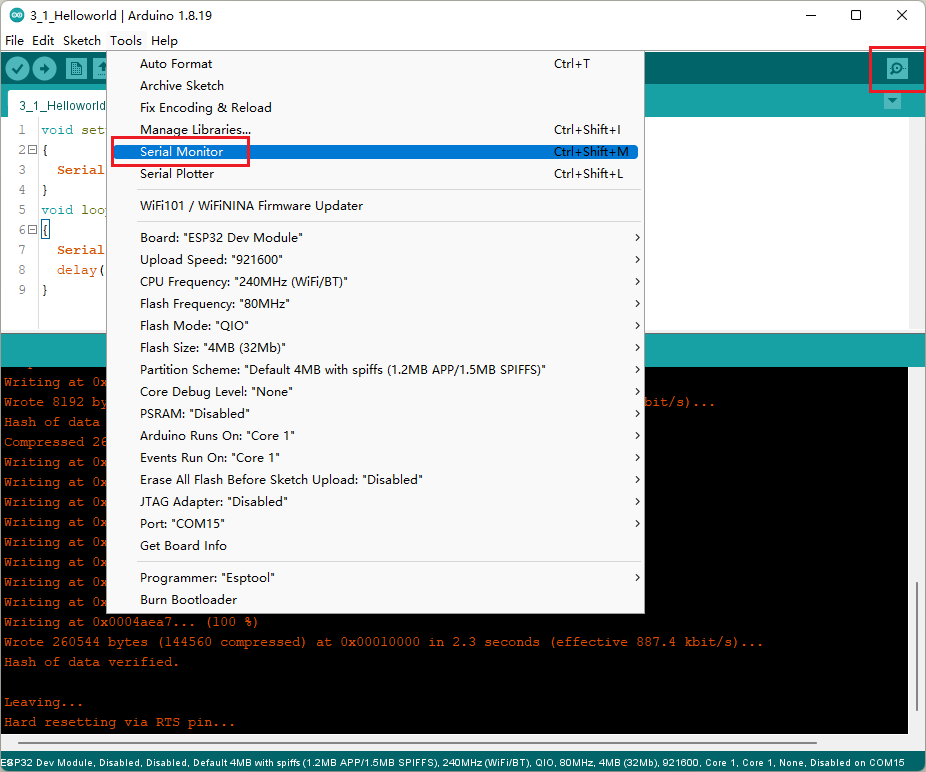
5. 通过串口监视器查看程序串口数据打印，此处需要注意的是串口设定的波特率需要同程序里设定的一致，否则会出现乱码
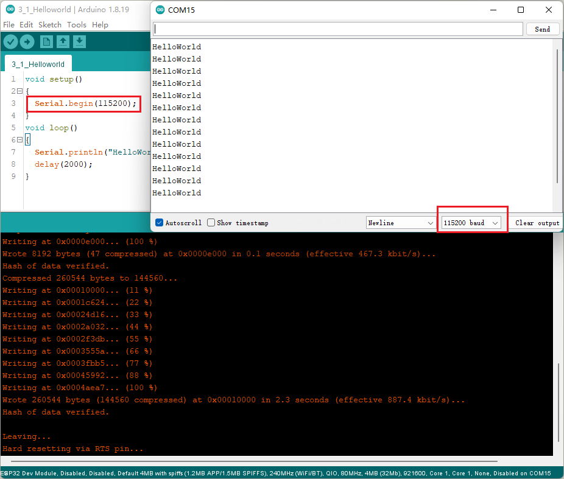

## 结束
教程到此结束，如果遇到操作反馈异常的地方，请到评论区进行评论